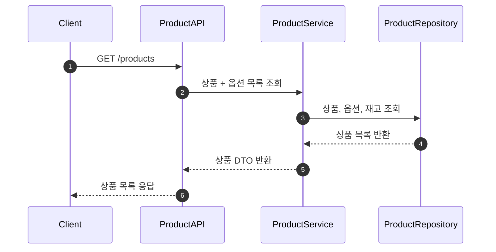
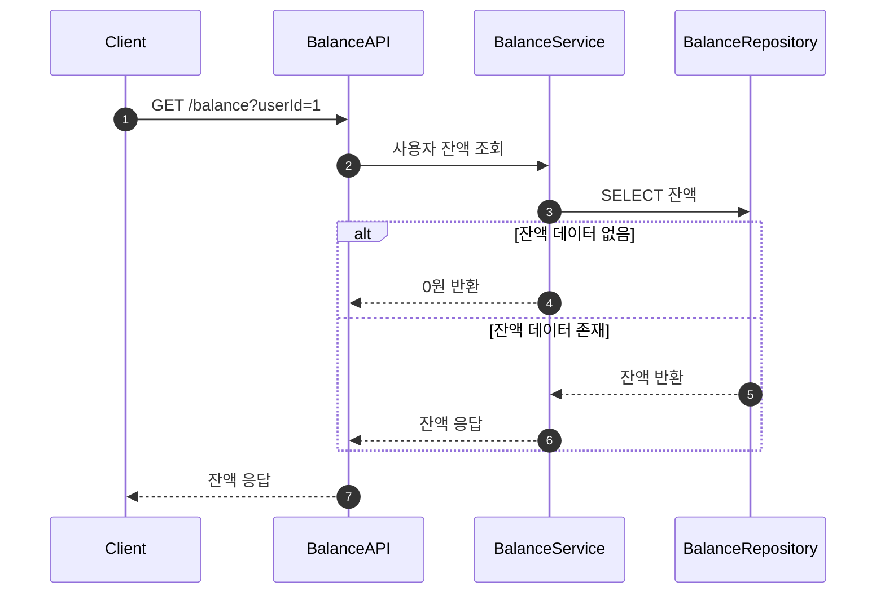
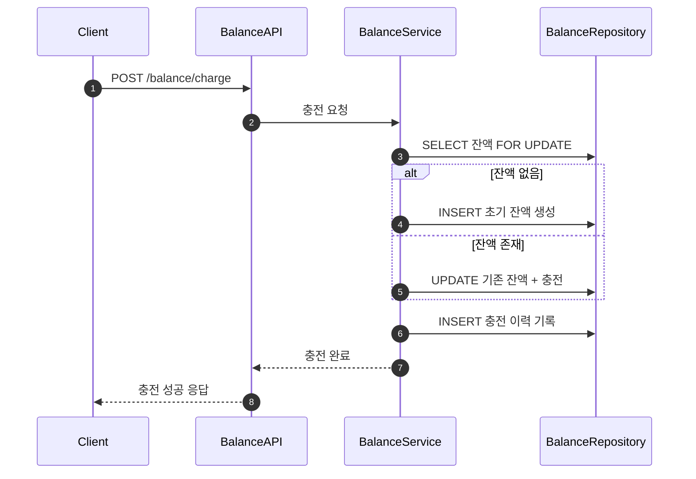
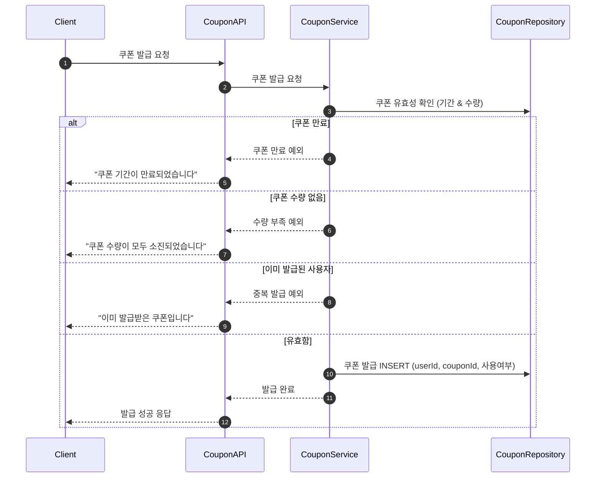
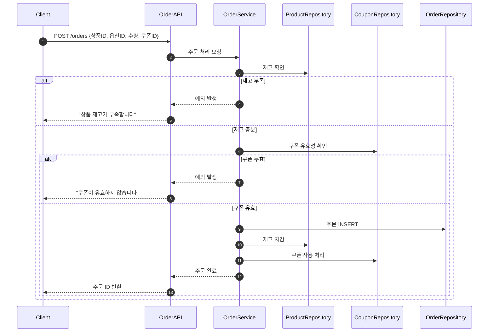
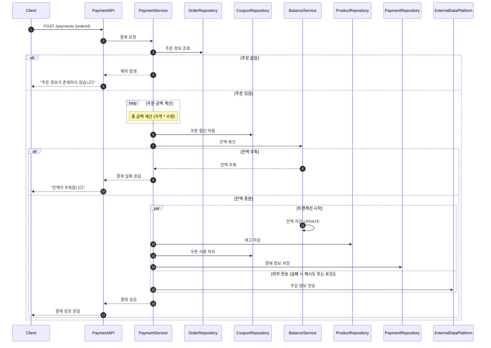
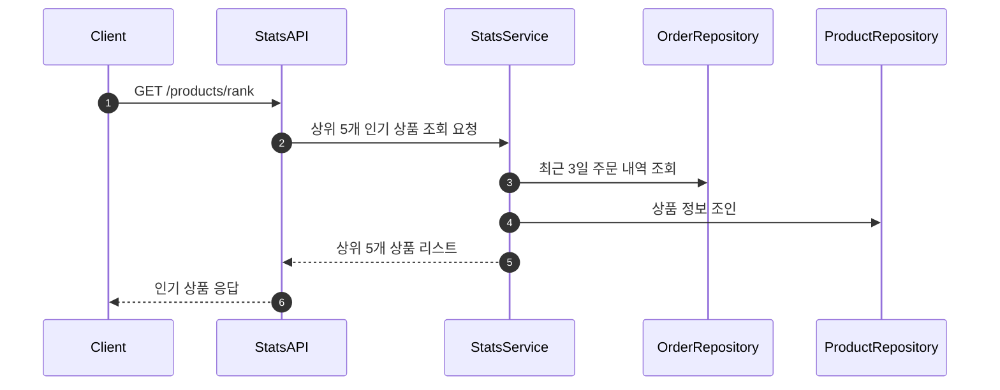

## 상품 조회 API

```mermaid
sequenceDiagram
    autonumber
    participant Client
    Client->>ProductAPI: GET /products
    ProductAPI->>ProductService: 상품 + 옵션 목록 조회
    ProductService->>ProductRepository: 상품, 옵션, 재고 조회
    ProductRepository-->>ProductService: 상품 목록 반환
    ProductService-->>ProductAPI: 상품 DTO 반환
    ProductAPI-->>Client: 상품 목록 응답
```

---

## 잔액 조회 API

```mermaid
sequenceDiagram
    autonumber
    participant Client
    Client->>BalanceAPI: GET /balance?userId=1
    BalanceAPI->>BalanceService: 사용자 잔액 조회
    BalanceService->>BalanceRepository: SELECT 잔액
    alt 잔액 데이터 없음
        BalanceService-->>BalanceAPI: 0원 반환
    else 잔액 데이터 존재
        BalanceRepository-->>BalanceService: 잔액 반환
        BalanceService-->>BalanceAPI: 잔액 응답
    end
    BalanceAPI-->>Client: 잔액 응답
```

---

## 잔액 충전 API

```mermaid
sequenceDiagram
    autonumber
    participant Client
    Client->>BalanceAPI: POST /balance/charge
    BalanceAPI->>BalanceService: 충전 요청
    BalanceService->>BalanceRepository: SELECT 잔액 FOR UPDATE
    alt 잔액 없음
        BalanceService->>BalanceRepository: INSERT 초기 잔액 생성
    else 잔액 존재
        BalanceService->>BalanceRepository: UPDATE 기존 잔액 + 충전
    end
    BalanceService->>BalanceRepository: INSERT 충전 이력 기록
    BalanceService-->>BalanceAPI: 충전 완료
    BalanceAPI-->>Client: 충전 성공 응답
```

---

## 선착순 쿠폰 발급 API

```mermaid
sequenceDiagram
    autonumber
    participant Client
    participant CouponAPI
    participant CouponService
    participant CouponRepository

    Client->>CouponAPI: 쿠폰 발급 요청
    CouponAPI->>CouponService: 쿠폰 발급 요청
    CouponService->>CouponRepository: 쿠폰 유효성 확인 (기간 & 수량)

    alt 쿠폰 만료
        CouponService-->>CouponAPI: 쿠폰 만료 예외
        CouponAPI-->>Client: "쿠폰 기간이 만료되었습니다"
    else 쿠폰 수량 없음
        CouponService-->>CouponAPI: 수량 부족 예외
        CouponAPI-->>Client: "쿠폰 수량이 모두 소진되었습니다"
    else 이미 발급된 사용자
        CouponService-->>CouponAPI: 중복 발급 예외
        CouponAPI-->>Client: "이미 발급받은 쿠폰입니다"
    else 유효함
        CouponService->>CouponRepository: 쿠폰 발급 INSERT (userId, couponId, 사용여부)
        CouponService-->>CouponAPI: 발급 완료
        CouponAPI-->>Client: 발급 성공 응답
    end
```

---

## 주문 API

```mermaid
sequenceDiagram
    autonumber
    participant Client
    Client->>OrderAPI: POST /orders {상품ID, 옵션ID, 수량, 쿠폰ID}
    OrderAPI->>OrderService: 주문 처리 요청
    OrderService->>ProductRepository: 재고 확인
    alt 재고 부족
        OrderService-->>OrderAPI: 예외 발생
        OrderAPI-->>Client: "상품 재고가 부족합니다"
    else 재고 충분
        OrderService->>CouponRepository: 쿠폰 유효성 확인
        alt 쿠폰 무효
            OrderService-->>OrderAPI: 예외 발생
            OrderAPI-->>Client: "쿠폰이 유효하지 않습니다"
        else 쿠폰 유효
            OrderService->>OrderRepository: 주문 INSERT
            OrderService->>ProductRepository: 재고 차감
            OrderService->>CouponRepository: 쿠폰 사용 처리
            OrderService-->>OrderAPI: 주문 완료
            OrderAPI-->>Client: 주문 ID 반환
        end
    end
```

---

## 결제 API

```mermaid
sequenceDiagram
    autonumber
    participant Client
    Client->>PaymentAPI: POST /payments {orderId}
    PaymentAPI->>PaymentService: 결제 요청
    PaymentService->>OrderRepository: 주문 정보 조회
    alt 주문 없음
        PaymentService-->>PaymentAPI: 예외 발생
        PaymentAPI-->>Client: "주문 정보가 존재하지 않습니다"
    else 주문 있음
        loop 주문 금액 계산
            Note over PaymentService: 총 금액 계산 (가격 * 수량)
        end
        PaymentService->>CouponRepository: 쿠폰 할인 적용
        PaymentService->>BalanceService: 잔액 확인
        alt 잔액 부족
            BalanceService-->>PaymentService: 잔액 부족
            PaymentService-->>PaymentAPI: 결제 실패 응답
            PaymentAPI-->>Client: "잔액이 부족합니다"
        else 잔액 충분
            par 트랜잭션 시작
                BalanceService->>BalanceService: 잔액 차감 UPDATE
                PaymentService->>ProductRepository: 재고 차감
                PaymentService->>CouponRepository: 쿠폰 사용 처리
                PaymentService->>PaymentRepository: 결제 정보 저장
            and 외부 전송 (실패 시 재시도 또는 로깅)
                PaymentService->>ExternalDataPlatform: 주문 정보 전송
            end
            PaymentService-->>PaymentAPI: 결제 성공
            PaymentAPI-->>Client: 결제 성공 응답
        end
    end
```

---

## 인기 상품 조회 API

```mermaid
sequenceDiagram
    autonumber
    participant Client
    Client->>StatsAPI: GET /products/rank
    StatsAPI->>StatsService: 상위 5개 인기 상품 조회 요청
    StatsService->>OrderRepository: 최근 3일 주문 내역 조회
    StatsService->>ProductRepository: 상품 정보 조인
    StatsService-->>StatsAPI: 상위 5개 상품 리스트
    StatsAPI-->>Client: 인기 상품 응답
```
